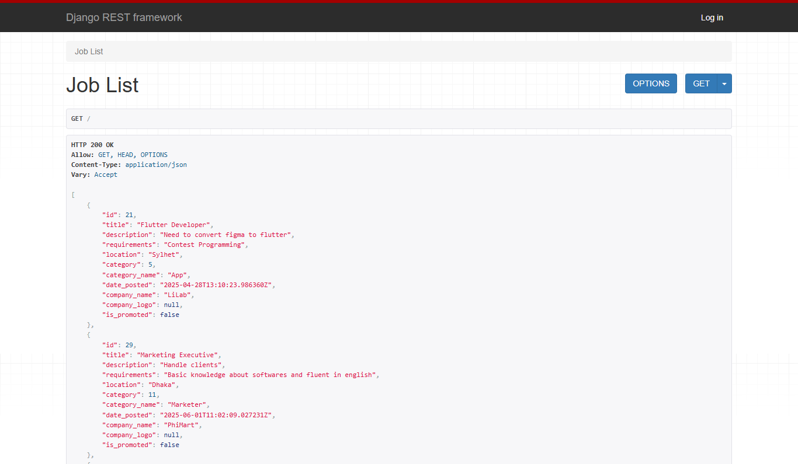

# 🖥️ JobDorkar — Django Backend

## 📄 Description  
This is the **backend API** for the full-stack job portal application **JobDorkar**. Built with **Django** and **Django REST Framework**, this backend provides secure authentication, role-based access control, job posting, applicant tracking, and resume handling functionalities. It connects to a **PostgreSQL** database and serves data to the [React frontend](https://github.com/cseishrakul/jobDorkar-react).

---

## 🚀 Features  
- RESTful API built with Django REST Framework  
- Role-based registration and authentication (Employer / Job Seeker)  
- JWT-based authentication (or session — based on config)  
- Employers can:
  - Create and manage job posts  
  - View applicants and download resumes  
- Job Seekers can:
  - Browse job listings  
  - Submit applications with resume upload  
- Admin can manage users and job posts  
- PostgreSQL integration  
- CORS configured for frontend API requests  

---

## 🛠️ Technologies Used  
- **Backend Framework:** Django  
- **API:** Django REST Framework  
- **Database:** PostgreSQL  
- **Authentication:** Django Auth / JWT  
- **File Handling:** Django Media (resume upload)  
- **Cross-Origin:** Django CORS Headers  
- **Frontend:** [JobDorkar React Frontend](https://github.com/cseishrakul/jobDorkar-react)

---
## 🌐 Live Demo

✨ You can explore the live version of the project here:  
👉 **[JobDorkar - Api](https://job-dorkar.vercel.app/)**
---

## 🧑‍💻 Local Setup Instructions

To run this backend locally, follow these steps:

# 1. Clone the repository
git clone https://github.com/cseishrakul/jobDorkar.git
cd jobDorkar

# 2. Create a virtual environment
python -m venv job_env

# 3. Activate the environment
# On Windows:
job_env\Scripts\activate
# On Mac/Linux:
source job_env/bin/activate

# 4. Install dependencies
pip install -r requirements.txt

# 5. Setup PostgreSQL database
# Make sure to create a PostgreSQL database and update your DATABASES config in settings.py

# 6. Run migrations
python manage.py makemigrations
python manage.py migrate

# 7. Create superuser
python manage.py createsuperuser

# 8. Start the development server
python manage.py runserver
